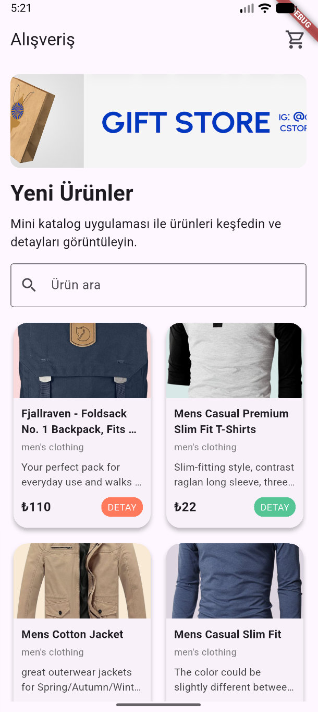
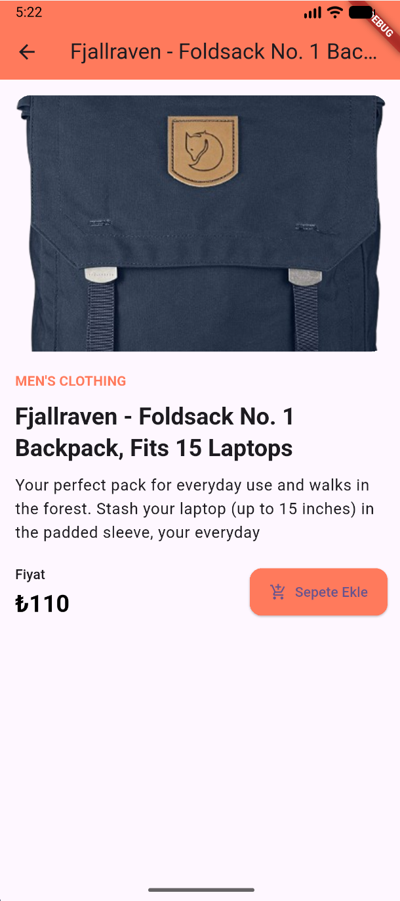
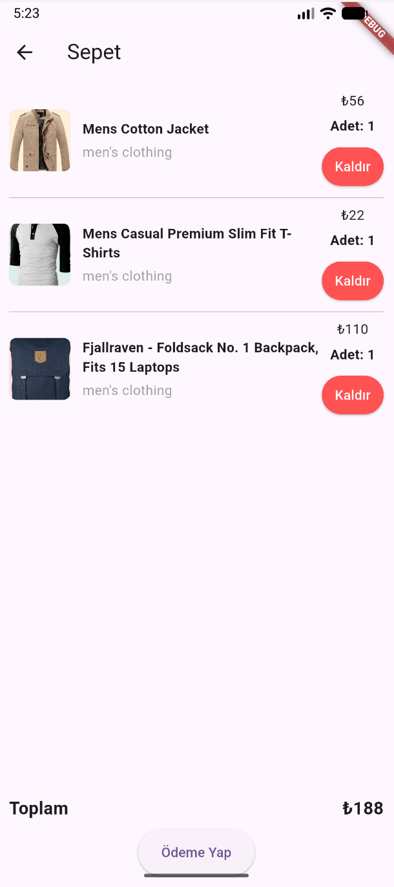

# Alışveriş Uygulaması

Bu proje, Flutter kullanarak hazırlanmış temel bir alışveriş uygulaması örneğidir. Uygulama, ürün listeleme, ürün detay sayfası, sayfa geçişleri, arama ve basit bir sepet simülasyonu içerir.


## Kullanılan Araçlar

- Flutter SDK
- Dart SDK (Flutter ile birlikte gelir)
- Visual Studio Code
- Android Studio / Android Emulator veya fiziksel Android cihaz

## Kullanılan Paketler

- `material.dart` (Flutter'ın varsayılan materyal paketi)
- Ek paket kullanılmamıştır.

## Veri Kaynağı

- Ürün verileri için Fake Store API kullanıldı: https://fakestoreapi.com/products
- Bu proje eğitim amaçlıdır ve gerçek bir e-ticaret altyapısı değildir.

## Flutter Sürümü

- Flutter 3.44.6

## Çalıştırma Adımları

1. Flutter SDK ve Android Studio yüklü olduğundan emin olun.
2. Terminalde proje klasörüne gidin
3. Bağımlılıkları yükleyin:
   ```bash
   flutter pub get
   ```
4. Uygulamayı çalıştırın:
   ```bash
   flutter run
   ```

## Proje Yapısı

- `lib/main.dart`: Uygulamanın giriş noktası ve ana sayfa
- `lib/models/product.dart`: Ürün model sınıfı
- `lib/data/product_data.dart`: Ürün verisini yükleme ve JSON dönüştürme
- `lib/screens/product_detail.dart`: Ürün detay ekranı
- `lib/screens/cart_screen.dart`: Sepet ekranı


## Ekran Görüntüleri

### Home Page:

 

### Ürün Detay:

 

### Sepet:


